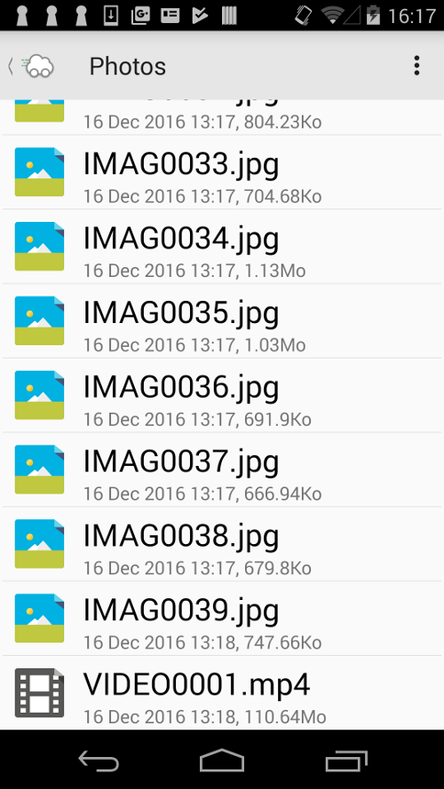

## Basic Overview
drivinCloud Open is an android webdav client

## What's included
- Webdav credentials manager (Store multiple webdav connection informations)
- Files/Folders navigation
- Text files editing
- Image preview / Slideshow
- File upload

## Getting the app
Google Play Store : https://play.google.com/store/apps/details?id=org.phpnet.openDrivinCloudAndroid
Apk download : https://github.com/phpnetfrance/drivinCloudOpen/releases/download/1.0/drivinCloudOpen-1.0.apk

## Project Setup
This project is made using android studio. You can import the project in android studio easily :
- VCS Menu -> Checkout from version control -> Git
- Paste the repository URL (https://github.com/phpnetfrance/drivinCloudOpen)

## Licence
Copyright 2017 PHPNET FRANCE

Licensed under the Apache License, Version 2.0 (the "License"); you may not use this file except in compliance with the License. You may obtain a copy of the License at

  http://www.apache.org/licenses/LICENSE-2.0

Unless required by applicable law or agreed to in writing, software distributed under the License is distributed on an "AS IS" BASIS, WITHOUT WARRANTIES OR CONDITIONS OF ANY KIND, either express or implied. See the License for the specific language governing permissions and limitations under the License.
